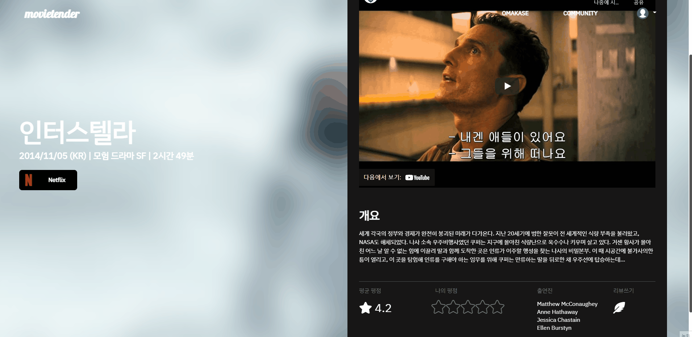
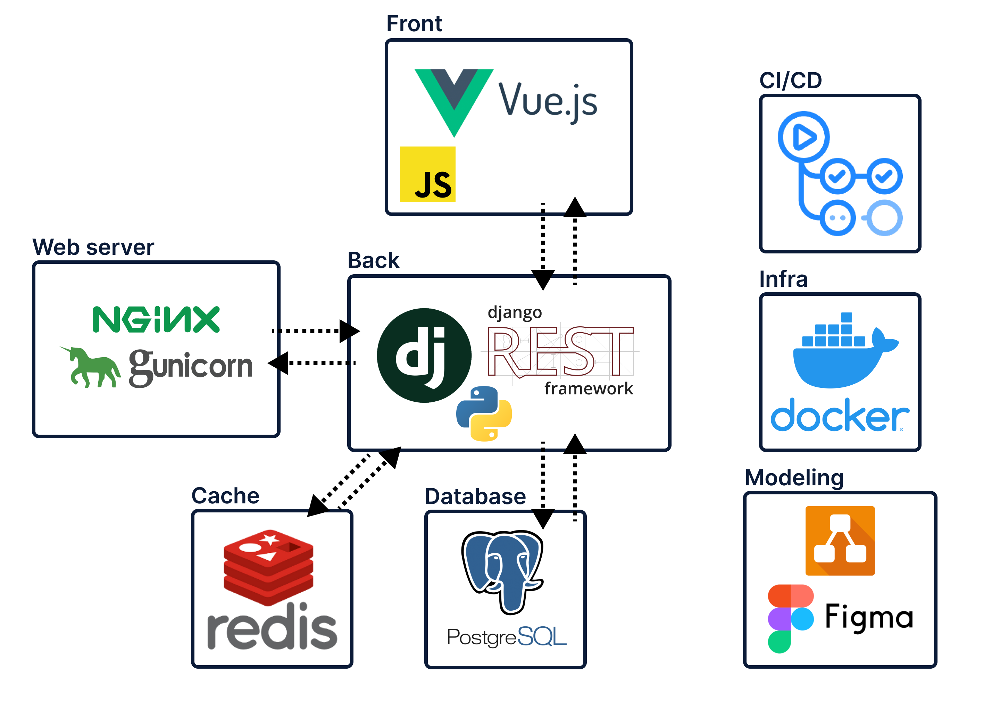

# :movie_camera: movietender

<a target="_blank" href="https://movietender.link">
  
</a>

<a style="float: right;" href="https://codecov.io/gh/YanZisuka/movie-tender" target="_blank">
  
</a>

<br>

## :mag_right: 소개

### :computer: Contributors

| yeonggyeong                                                                                                                               | YanZisuka                                                                                                                             |
|:-----------------------------------------------------------------------------------------------------------------------------------------:|:-------------------------------------------------------------------------------------------------------------------------------------:|
| <a href="https://github.com/yeonggyeong" target="_blank"></a> | <a href="https://github.com/YanZisuka" target="_blank"></a> |
| 공영경                                                                                                                                       | 한승재                                                                                                                                   |

<br>

### :call_me_hand: Ground Rule

- 프로젝트는 대면을 원칙으로 진행합니다.
- **하나 이상의 기능 구현시,** `개발 일지`를 **작성하는 것을 원칙으로** 합니다.
- **브랜치 전략**
  - [GitHub-flow](https://docs.github.com/en/get-started/quickstart/github-flow)

<br>

#### :page_with_curl: 개발 일지

- 구현에 사용된 기술과 해당 기술 선택 이유
- 구현 내용
- 개인적 소감 (*Optional*)
- 어려웠던 점 & 해결 방법 (*Optional*)

<br>

### :pencil2: Convention

- **파일명**
  - 컴포넌트의 파일명은 `UpperCamelCase`로 작성합니다.

<br>

- **변수명**
  - `django`는 `snake_case`, `vue.js`는 `lowerCamelCase`를 원칙으로 사용합니다.
  - `class` 작성 시 `UpperCamelCase`를 사용합니다.
  - `index`를 의미하는 `i`나 `count`를 의미하는 `cnt` 등 통용되는 줄임말이 아닌 경우, 변수명을 축약하지 않는 것을 원칙으로 합니다.
  - 컨테이너형인 경우 복수형을 원칙으로 사용합니다.

<br>

- **함수명**
  - 함수명은 기본적으로 `setAttribute`와 같이 동사로 시작합니다.

<br>

- **커밋 메시지**
  - `TASK_TYPE`: `ADD`, `FIX`, etc.,

```bash
$ git commit -m '[TASK_TYPE] task_content' -m 'description[Optional]'
```

<br>

- **브랜치명**

```bash
$ git checkout -b '[task_type]-[target]'
$ git push -u origin [branch_name]
```

<br><br>

## :wrench: 기능

- `인덱스`
  
  - 사이트의 기능들을 소개하고, 다른 기능들로 연결합니다.

- `커뮤니티`
  
  
  
  - 사용자가 **추천받고, 시청한 영화에 대해 리뷰를 작성할 수** 있습니다.
  - 각 리뷰에 **좋아요, 댓글을 작성** 가능합니다.

- `영화 추천`
  
  
  
  - 각 영화를 나타내는 **`keywords` 기반 추천을** 통해 사용자에게 최적의 영화를 추천합니다.

<br><br>

## :books: 기술 스택



<br><br>

## :office: 프로젝트 구조

```
📂 Movietender
├── 📂 client
│   ├── 📂 node_modules
│   ├── 📂 public
│   └── 📂 src
│       ├── 📂 api
│       ├── 📂 assets
│       ├── 📂 components
│       ├── 📂 router
│       ├── 📂 store
│       │   └── 📂 modules
│       ├── 📂 views
│       ├── App.vue
│       └── main.js
└── 📂 server
    ├── 📂 accounts
    ├── 📂 community
    ├── 📂 movies
    ├── 📂 server
    └── manage.py
```

<br><br>

## :cd: ERD

- <a href="https://drive.google.com/file/d/1WqgOLr7BNAP7_DBBk-ysWIDRL2eX6Bk4/view?usp=sharing" target="_blank">draw.io</a>

<br><br>

## :iphone: 프로토타입

- <a href="https://www.figma.com/file/oQ3cjXbhtswUeQCz41NzOO/Movietender?node-id=0%3A1" target="_blank">Figma</a>
